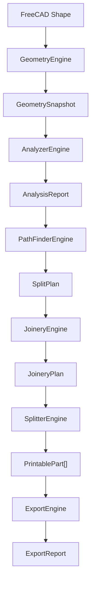
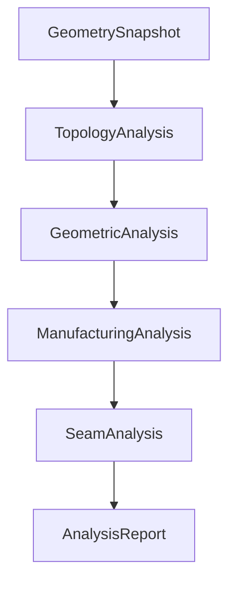

# PanelOptimizer Architecture

## 1. Vision

PanelOptimizer is a FreeCAD workbench for intelligently splitting large
printable panels into smaller printable parts while minimizing the visibility
of assembly joints.

The core is intended to be a reusable panel-optimization framework. It is not
coupled to one artwork, printer, or manufacturing profile.

## 2. Core principles

- Single Responsibility: each engine and observation type has one purpose.
- Immutable data models: engine boundaries exchange frozen value objects.
- Pipeline architecture: each stage consumes established upstream facts.
- No global state: dependencies and settings are supplied explicitly.
- Dependency Injection: FreeCAD shapes are accessed through caller-owned,
  read-only resolvers.
- Explicit data contracts: units, coordinate conventions, and ownership are
  stated by each model.
- Determinism: unchanged input produces stable observations and identifiers.
- Evaluation follows observation: measuring geometry is separate from deciding
  whether it is manufacturable or useful for a seam.

## 3. Global pipeline

`GeometryEngine` takes a read-only measurement snapshot. `AnalyzerEngine`
describes the source in ordered analysis stages. `PathFinderEngine` plans cuts
from completed analysis. `JoineryEngine` describes joints for an approved split
plan. `SplitterEngine` creates new printable geometry. `ExportEngine` writes
approved results.

### Analyzer stages

The stages are cumulative contracts, not interchangeable categories:

1. `GeometrySnapshot` owns source-wide measurements and raw topology counts.
2. `TopologyAnalysis` owns structural facts and connectivity.
3. `GeometricAnalysis` owns local measurements and descriptive geometric
   observations.
4. `ManufacturingAnalysis` will evaluate observations against a manufacturing
   context.
5. `SeamAnalysis` will evaluate geometry specifically for seam planning.

An `AnalysisReport` may be partial while stages are being developed. Empty
frozen model defaults represent stages that have not been activated.
The current `AnalyzerEngine` activates `TopologyAnalysis`, then the thickness
and clearance portions of `GeometricAnalysis`. The remaining geometric
collections, `ManufacturingAnalysis`, and `SeamAnalysis` remain at their
model-defined defaults.

## 4. Engine responsibilities

### GeometryEngine

- Purpose: validate and measure a caller-owned source shape.
- Input: read-only shape and source identity.
- Output: `GeometrySnapshot`.
- Must not: detect local features, make manufacturing decisions, access GUI
  state, or modify a document.

### AnalyzerEngine

- Purpose: coordinate ordered, read-only analysis stages.
- Inputs: `GeometrySnapshot` and an injected source-shape resolver.
- Output: `AnalysisReport`.
- Must not: modify geometry, generate paths, score alternatives, split the
  source, create joinery, or export files.

### PathFinderEngine

- Purpose: create a split plan from completed analysis.
- Input: `AnalysisReport`.
- Output: `SplitPlan`.
- Must not: remeasure geometry, manufacture parts, or apply joinery.

### JoineryEngine

- Purpose: define assembly joints for a selected split plan.
- Input: `SplitPlan`.
- Output: `JoineryPlan`.
- Must not: select split paths, alter source analysis, or export files.

### SplitterEngine

- Purpose: create printable-part geometry from approved plans.
- Inputs: geometry identity, `SplitPlan`, `JoineryPlan`, and an injected shape
  resolver.
- Output: immutable `PrintablePart` records referencing created geometry.
- Must not: score plans, perform analysis, or export files.

### ExportEngine

- Purpose: serialize approved printable parts and report emitted artifacts.
- Inputs: `PrintablePart` records and export destination.
- Output: `ExportReport`.
- Must not: analyze, plan, split, or modify part design.

## 5. Analysis responsibility boundaries

### GeometrySnapshot: global source measurements

`GeometrySnapshot` exclusively owns the source identity, axis-aligned bounding
box, center, global width, height and thickness, total area and volume, solid,
face, edge and vertex counts, shape type, closed state, and validation state.

Later stages may reference these facts but must not duplicate them as new global
measurements.

### TopologyAnalysis: structural facts

`TopologyAnalysis` owns holes, disconnected islands, enclosed cavities, dead-end
regions, and material-region connectivity. Measurements required to describe a
specific topological feature remain part of that feature.

Topology does not own general local thickness, arbitrary boundary clearance,
surface curvature, manufacturing adequacy, or seam suitability.

### GeometricAnalysis: measurable observations

`GeometricAnalysis` is a report composed of focused immutable records:

| Collection | Scope | Meaning and units |
|---|---|---|
| `thickness_observations` | Local | Distance in mm between opposite material boundaries |
| `clearance_observations` | Local | Direct separation in mm between relevant source boundaries |
| `material_ligaments` | Local segment | Width in mm of a proven continuous-material segment between two boundaries |
| `edge_observations` | Local element | Source-edge endpoints, curve family, closure, and length in mm |
| `corner_observations` | Local element | Source-vertex position and included angle in degrees |
| `curvature_observations` | Local sample | Principal surface curvatures in 1/mm and their model-space directions |
| `flat_regions` | Local region | Connected planar area in mm², bounds, normal, faces, and boundary edges |
| `symmetries` | Source relationship | Reflection or rotational relationship and maximum deviation in mm |
| `feature_proximities` | Feature pair | Nearest-point distance in mm between two topology features |
| `complexity_indicators` | Global description | Source-wide non-analytic and continuity counts not stored by `GeometrySnapshot` |

These records describe measured evidence only. Words such as “flat” and
“complexity” identify observation categories; they do not imply acceptance,
rejection, ranking, or a threshold.

`ClearanceObservation` describes a separation relationship between boundaries
or features. `MaterialLigamentObservation` describes the different geometric
fact that the same transverse segment is proven to be continuous material.
Both may reference the same exact measurement evidence without conflicting:
clearance owns the separation relationship, while the ligament owns material
continuity. A ligament does not imply that its width is thin, wide, adequate,
or unsuitable.

Only `ThicknessObservation` and `ClearanceObservation` are currently
populated. Their analyzers conservatively omit geometry when an exact,
supported local measurement cannot be established. The other observation
types remain contracts only.

### ManufacturingAnalysis: reserved evaluations

Manufacturing analysis is reserved for interpreting observations against an
explicit manufacturing context. Future responsibilities include minimum wall
or ligament requirements, process clearance, overhang and support concerns,
printer-envelope checks, material constraints, and structured warnings.

It owns pass/fail or severity decisions. `GeometricAnalysis` must not contain
printer limits, manufacturing tolerances, warning severity, or printability
flags.

### SeamAnalysis: reserved seam evidence

Seam analysis is reserved for interpreting topology and geometry specifically
for joint visibility and seam placement. It owns safe or forbidden candidate
zones and their seam-specific rationale.

It must not generate paths or rank candidates. Path creation belongs to
`PathFinderEngine`; scoring belongs to scoring contracts and their future
engine.

## 6. Geometric observation conventions

All observation models are frozen dataclasses and use tuples for collections.
They store no FreeCAD objects, document references, or mutable containers.

- Coordinates: `Point3D` uses the source shape's model coordinate system in
  millimetres.
- Directions: `Direction3D` uses dimensionless model-coordinate components.
- Length: millimetres (`*_mm`).
- Area: square millimetres (`*_mm2`).
- Volume: cubic millimetres (`*_mm3`), owned globally by `GeometrySnapshot`
  and by topology features only when required to describe them.
- Curvature: inverse millimetres (`*_per_mm`).
- Angles: degrees (`*_degrees`).
- Counts and rotational order: dimensionless integers.
- Source element IDs: stable references to canonical source face, edge, or
  vertex order; never FreeCAD objects.
- Related feature IDs: references to immutable `TopologyAnalysis` feature IDs.
- Observation IDs:
  `{source_id}:geometry:{observation-kind}:{index:04d}`.

Indices follow a canonical deterministic source ordering appropriate to the
observation type. Equality is value-based. No observation ID depends on object
memory addresses, discovery timing, scores, manufacturing settings, or printer
limits.

## 7. Core model organization

`Core.Models` contains immutable contracts only:

- `Common`: points, directions, and bounding boxes.
- `Geometry`: the source-wide geometry snapshot.
- `Analysis`: staged report composition plus topology, manufacturing, and seam
  records.
- `Thickness`, `Clearance`, `Ligaments`, `Edges`, `Curvature`, `Symmetry`, and
  `Complexity`: focused geometric observation records.
- `Paths`: unranked candidate path records.
- `Scoring`: explainable scoring and ranking records.
- `Split`: split, joinery, and printable-part plans.
- `Export`: exported artifact and report records.

Models contain no business logic and do not import FreeCAD.

## 8. Dependency rules

- Engines communicate through `Core.Models`.
- Analysis components may consume upstream immutable models but never later
  stage results.
- Engine modules do not import other engine modules.
- Commands and GUI contain no analysis or optimization algorithms.
- Models never know FreeCAD documents or runtime objects.
- A resolved shape remains caller-owned and read-only.
- Manufacturing and printer settings do not enter descriptive geometry models.

## 9. Future evolution

Additional engines such as mesh, orientation, support, cost, or simulation
engines may consume existing immutable contracts or introduce focused new
contracts. They must not force unrelated responsibilities into current models.

## 10. Development rules

- Implement one coherent stage or contract change at a time.
- Design contracts before algorithms.
- Add contract tests before detection optimization.
- Centralize settings; do not embed manufacturing limits in observations.
- Preserve deterministic behavior and explicit exceptions.
- Keep models small, focused, immutable, and FreeCAD-independent.

## 11. Long-term vision

PanelOptimizer should become a reusable optimization framework supporting
multiple panel geometries, manufacturing technologies, analysis engines, and
optimization strategies without weakening the boundaries between measurement,
evaluation, planning, construction, and export.
