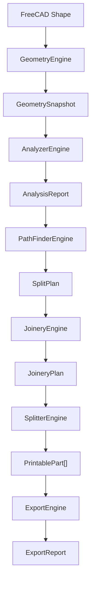
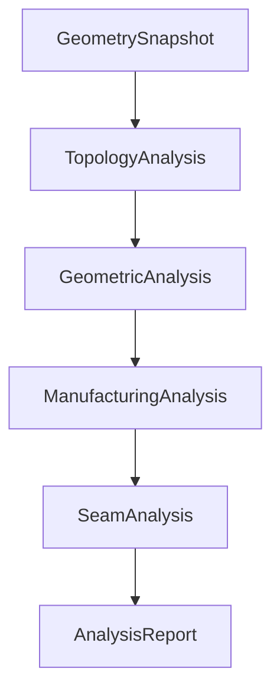

# PanelOptimizer Architecture

## 1. Vision

PanelOptimizer is a FreeCAD workbench for intelligently splitting large
printable panels into smaller printable parts while minimizing the visibility
of assembly joints.

The core is intended to be a reusable panel-optimization framework. It is not
coupled to one artwork, printer, or manufacturing profile.

## 2. Core principles

- Single Responsibility: each engine and observation type has one purpose.
- Immutable data models: engine boundaries exchange frozen value objects.
- Pipeline architecture: each stage consumes established upstream facts.
- No global state: dependencies and settings are supplied explicitly.
- Dependency Injection: FreeCAD shapes are accessed through caller-owned,
  read-only resolvers.
- Explicit data contracts: units, coordinate conventions, and ownership are
  stated by each model.
- Determinism: unchanged input produces stable observations and identifiers.
- Evaluation follows observation: measuring geometry is separate from deciding
  whether it is manufacturable or useful for a seam.

## 3. Global pipeline



`GeometryEngine` takes a read-only measurement snapshot. `AnalyzerEngine`
describes the source in ordered analysis stages. `PathFinderEngine` plans cuts
from completed analysis. `JoineryEngine` describes joints for an approved split
plan. `SplitterEngine` creates new printable geometry. `ExportEngine` writes
approved results.

V4.00 also provides a deliberately bounded prototype path that bypasses the
unimplemented intelligent path, scoring, and joinery stages:

```text
one selected solid
    -> bounding-box center X/Y split
    -> four validated quadrant solids
    -> effective X/Y limit validation
    -> four STL files
```

This prototype is not evidence that `PathFinderEngine`, scoring,
`SeamAnalysis`, or `JoineryEngine` has been implemented.

### Analyzer stages



The stages are cumulative contracts, not interchangeable categories:

1. `GeometrySnapshot` owns source-wide measurements and raw topology counts.
2. `TopologyAnalysis` owns structural facts and connectivity.
3. `GeometricAnalysis` owns local measurements and descriptive geometric
   observations.
4. `ManufacturingAnalysis` interprets upstream evidence against an injected,
   immutable manufacturing profile. Build-envelope, minimum-thickness,
   minimum-ligament, and typed minimum-clearance rules are active.
5. `SeamAnalysis` is the inactive, architecture-defined stage for converting
   upstream facts into non-scoring seam-placement evidence and constraints.

An `AnalysisReport` may be partial while stages are being developed. Empty
frozen model defaults represent stages that have not been activated.
The current `AnalyzerEngine` activates `TopologyAnalysis` and every approved
`GeometricAnalysis` collection: thickness, clearance, material ligament, edge,
corner, curvature, flat region, symmetry, feature proximity, and geometric
complexity. It then composes or accepts an immutable `ManufacturingProfile`
and activates the implemented `ManufacturingAnalysis` rules. `SeamAnalysis`
remains at its exact model-defined default.

## 4. Engine responsibilities

### GeometryEngine

- Purpose: validate and measure a caller-owned source shape.
- Input: read-only shape and source identity.
- Output: `GeometrySnapshot`.
- Must not: detect local features, make manufacturing decisions, access GUI
  state, or modify a document.

### AnalyzerEngine

- Purpose: coordinate ordered, read-only analysis stages.
- Inputs: `GeometrySnapshot` and an injected source-shape resolver.
- Output: `AnalysisReport`.
- Must not: modify geometry, generate paths, score alternatives, split the
  source, create joinery, or export files.

### PathFinderEngine

- Purpose: generate candidate route geometry and select routes for a split
  plan using explicit analysis and future scoring results.
- Inputs: `AnalysisReport` and, when implemented, explicit scoring results.
- Output: `SplitPlan`.
- Must not: define scoring criteria or weights, remeasure geometry, manufacture
  parts, or apply joinery.

### Scoring

- Purpose: perform weighted, explainable comparison of generated candidate
  routes.
- Inputs: immutable candidate paths, seam evidence, and a scoring profile.
- Output: score breakdowns and deterministic rankings.
- Must not: generate route geometry, reinterpret manufacturing facts, mutate
  seam evidence, select a split plan, or split the source.

### JoineryEngine

- Purpose: define assembly joints for a selected split plan.
- Input: `SplitPlan`.
- Output: `JoineryPlan`.
- Must not: select split paths, alter source analysis, or export files.

### SplitterEngine

- Purpose: create printable-part geometry. V4.00 implements only the fixed
  four-quadrant center-plane prototype; future planned paths remain reserved.
- Prototype inputs: one caller-owned solid, its stable source ID, and
  authoritative `Settings.Split` effective X/Y limits.
- Output: immutable `PrintablePart` records referencing created geometry.
- Must not: score plans, perform analysis, or export files.

### ExportEngine

- Purpose: serialize approved printable parts and report emitted artifacts.
- Inputs: exactly four validated `PrintablePart` records, an explicit
  caller-selected destination, and an injected runtime shape resolver.
- Output: `ExportReport`.
- Must not: analyze, plan, split, or modify part design.

### V4.00 fixed split prototype

`SplitterEngine.split_four_quadrants` validates that the source contains
exactly one valid non-empty solid. It calculates X/Y cuts at the source
axis-aligned bounding-box center and runs one
OpenCASCADE `generalFuse` operation with two bounded planar faces spanning and
extending beyond the full source bounds. This avoids coincident cutting-face
edges at a complex source boundary while retaining the exact center planes.
Since the zero-volume tools contribute no solids, all
resulting solids are source material; avoiding SplitAPI history filtering is
important for complex sources whose valid pieces may lack mapped history. It never meshes,
heals, refines, fills, simplifies, or modifies the caller's source. Existing
holes and other boundary geometry are preserved by the coherent partition.

Quadrant order is deterministic in model coordinates:

1. `Part_1`: lower-left
2. `Part_2`: lower-right
3. `Part_3`: upper-left
4. `Part_4`: upper-right

Partition solids are deterministically sorted and classified by their exact
bounding half-spaces, never merely by center of mass. A fragment that still
crosses a cut is rejected. More than one fragment in a quadrant is reported as
disconnected source material and is not silently fused. Every final result
must be one non-empty valid closed solid. Distinct quadrant half-spaces cannot
overlap in their interiors, and the sum of result volumes must equal source volume within
`max(1e-6 mm3, source_volume * 1e-9)`. These values validate B-rep operations;
they are not manufacturing allowances.

Each `PrintablePart` records its source/result relationship, quadrant, bounds,
X/Y/Z dimensions, volume, independent X/Y limit outcomes, overall printable
state, and validation messages. The effective limits come only from
`Settings.Split.MAX_PART_WIDTH/HEIGHT`; legacy
`Settings.Printer.MAX_PART_SIZE` is not read. Oversized results remain valid
inspection geometry but are blocked from STL export.

`SplitExecution` pairs the immutable `SplitResult` with four runtime FreeCAD
shapes outside `Core.Models`. `SplitDocumentWriter` creates the group
`PanelOptimizer_Result` and exactly four visible `Part::Feature` objects. It
does not hide, replace, or delete the selected source. The group and parts
carry explicit PanelOptimizer ownership and provenance properties. A repeated
run updates only a complete ownership-marked result set in place, using B-rep
backups and a FreeCAD transaction so failure restores the previous valid
shapes. Delete-and-recreate was rejected because FreeCAD transaction abort did
not reliably restore group membership for reused object names. Unowned,
incomplete, or altered reserved-name sets fail before document mutation.

`ExportEngine` supports STL only in V4.00. It resolves each part through its
opaque geometry reference, writes four partial files, validates non-empty
content, and only then atomically finalizes `Part_1.stl` through `Part_4.stl`.
Known partial files are removed on failure, and pre-existing final files are
restored if finalization fails. The command always asks the user for an
existing output directory; it never chooses a hidden temporary destination.

### V4.10 pragmatic macro split path

`MacroSplitCore` is a deliberately direct runtime-geometry component extracted
from the proven `Chanfreins_Center profond.FCMacro` and
`chanfreins_avec_Offsets.FCMacro`. It copies the selected shape without asking
AnalyzerEngine or SourceShapeResolver to validate it, constructs the exact
asymmetric front-face groove profile (`1.2 mm` depth, `2.2 mm` top opening,
`0.5 mm` flat bottom, `20 mm` traversal overlap), and performs vertical then
horizontal `cut()` operations followed by best-effort `removeSplitter()`.

The real bounding-box center is kept separate from the effective cut location:
positive vertical offset moves cut X right and positive horizontal offset moves
cut Y up. `MacroSplitCore` returns one transient runtime shape plus scalar
metadata; it does not create four parts, validate printability, export files,
or place runtime geometry in `Core.Models`. The current Split command invokes
this path with zero offsets and creates one `FINAL_PANEL_BEVELED` result object.
The V4.00 `SplitterEngine`, document writer, and export engine remain available
but are not prerequisites for this pragmatic command path.

## 5. Analysis responsibility boundaries

### GeometrySnapshot: global source measurements

`GeometrySnapshot` exclusively owns the source identity, axis-aligned bounding
box, center, global width, height and thickness, total area and volume, solid,
face, edge and vertex counts, shape type, closed state, and validation state.

Later stages may reference these facts but must not duplicate them as new global
measurements.

### TopologyAnalysis: structural facts

`TopologyAnalysis` owns holes, disconnected islands, enclosed cavities, dead-end
regions, and material-region connectivity. Measurements required to describe a
specific topological feature remain part of that feature.

Topology does not own general local thickness, arbitrary boundary clearance,
surface curvature, manufacturing adequacy, or seam suitability.

### GeometricAnalysis: measurable observations

`GeometricAnalysis` is a report composed of focused immutable records:

| Collection | Scope | Meaning and units |
|---|---|---|
| `thickness_observations` | Local | Distance in mm between opposite material boundaries |
| `clearance_observations` | Local | Direct separation in mm between relevant source boundaries |
| `material_ligaments` | Local segment | Width in mm of a proven continuous-material segment between two boundaries |
| `edge_observations` | Local element | Source-edge endpoints, curve family, closure, and length in mm |
| `corner_observations` | Local element | Source-vertex position and included angle in degrees |
| `curvature_observations` | Local sample | Principal surface curvatures in 1/mm and their model-space directions |
| `flat_regions` | Local region | Connected planar area in mm², bounds, normal, faces, and boundary edges |
| `symmetries` | Source relationship | Reflection or rotational relationship and maximum deviation in mm |
| `feature_proximities` | Feature pair | Nearest-point distance in mm between two topology features |
| `complexity_indicators` | Global description | Source-wide non-analytic and continuity counts not stored by `GeometrySnapshot` |

These records describe measured evidence only. Words such as “flat” and
“complexity” identify observation categories; they do not imply acceptance,
rejection, ranking, or a threshold.

`ClearanceObservation` describes a separation relationship between boundaries
or features. `MaterialLigamentObservation` describes the different geometric
fact that the same transverse segment is proven to be continuous material.
Both may reference the same exact measurement evidence without conflicting:
clearance owns the separation relationship, while the ligament owns material
continuity. A ligament does not imply that its width is thin, wide, adequate,
or unsuitable.

For an implemented hole-to-hole relationship,
`FeatureProximityObservation` also reuses the exact clearance endpoints and
distance. It records the broader topology-feature relationship and never
performs a competing measurement. Hole-to-cavity and cavity-to-cavity
proximities instead use exact B-rep nearest-boundary distance.

`ThicknessObservation`, `ClearanceObservation`,
`MaterialLigamentObservation`, `EdgeObservation`, `CornerObservation`,
`CurvatureObservation`, `FlatRegionObservation`, and
`FeatureProximityObservation`, `SymmetryObservation`, and
`GeometricComplexityObservation` are currently populated. Analytic curvature
is limited to planes, cylinders, and spheres. Flat regions merge only
coplanar, same-solid planar faces connected by a shared source edge.

Symmetry detection is intentionally exact and bounded. It tests only the three
model-coordinate planes through `GeometrySnapshot.center`, in +X, +Y, +Z
normal order. A transient forward-oriented material copy is mirrored across
each candidate, and symmetry is recorded only when mutual B-rep subtraction
contains no remaining solid. Accepted reflections therefore have a measured
maximum deviation of zero. Approximate reflection and rotational symmetry are
not inferred.

Geometric complexity is one source-wide group of four dimensionless counts:
non-analytic source surfaces, non-analytic readable edge curves, adjacent
two-face boundaries with a proven tangent discontinuity, and vertices incident
to more than one surface family. Tangent boundaries with an unproven
higher-order curvature change are conservatively not counted. These values are
not weighted, normalized, labeled, ranked, or combined into a score.

All analyzers omit unsupported geometry rather than approximating or
evaluating it.

### ManufacturingAnalysis: fabrication constraint interpretation

Manufacturing analysis interprets observations against an explicit
manufacturing context. It consumes `GeometrySnapshot`,
`TopologyAnalysis`, `GeometricAnalysis`, and a versioned immutable
`ManufacturingProfile`. The currently implemented rules are build-envelope,
minimum local thickness, minimum material-ligament width, typed hole-to-hole
clearance, and typed hole-to-exterior clearance.

It owns pass/fail or severity decisions. `GeometricAnalysis` must not contain
printer limits, manufacturing tolerances, warning severity, or printability
flags.

The manufacturing contracts are:

| Contract | Responsibility |
|---|---|
| `BuildEnvelope` | Physical X/Y/Z extent, total safety margin per axis, effective allowed extent per axis, and enabled state |
| `ManufacturingConstraint` | One enabled scalar hard constraint or warning rule with comparison, limit, explicit unit, and failure severity |
| `ManufacturingProfile` | Profile ID/version, settings revision, process identity, optional build envelope, ordered constraints, and notes |
| `ConstraintEvaluation` | Explainable measured-versus-required result with status, severity, rationale, and upstream evidence IDs |
| `ManufacturingWarning` | Non-fatal advisory or warning linked to evaluations and evidence IDs |
| `ManufacturingAnalysis` | Profile provenance, ordered evaluations and warnings, plus a non-scored overall status |

The physical machine envelope is distinct from the effective allowed part
extent. `BuildEnvelope` retains both plus the configured total safety margin.
Current configured values remain owned by the centralized `Settings` system;
model modules never read global settings.

`ProfileComposer` applies this explicit settings ownership policy:

- `Settings.Printer.BED_SIZE_X/Y` own physical X/Y extents.
- `Settings.Split.MAX_PART_WIDTH/HEIGHT` own effective X/Y part limits.
- `Settings.Printer.MAX_PART_SIZE` is a legacy overlapping scalar and is not
  read by profile composition.
- Z is composed and evaluated only when both `Printer.BED_SIZE_Z` and
  `Split.MAX_PART_DEPTH` are configured. Neither is guessed by default.
- The total axis safety margin is physical extent minus effective extent.
- Optional minimum rules come only from `Settings.Manufacturing`; their
  default values are unconfigured and disabled.

Composition requires physical and effective extents to be finite and strictly
positive, rejects an effective limit larger than its physical extent, and
requires all three Z values to be either configured together or absent. The
total safety margin is finite and non-negative; zero is valid when physical
and effective extents are equal. Injected profiles receive the same envelope
coherence validation before evaluation, including the invariant
`margin = physical - effective`. Identical settings produce an equal profile
with stable ID, profile version, settings version, constraint order, and notes.
A caller may instead inject a complete immutable profile into `AnalyzerEngine`.
The invariant check allows only a centralized `1e-12 mm` absolute tolerance
for floating-point representation. Actual measured-versus-required constraint
comparisons remain exact and use no geometric or manufacturing allowance.

Hard constraints and warnings are separate concepts:

- A hard-constraint violation is a `ConstraintEvaluation` with status `fail`
  and prevents compatibility with the evaluated profile.
- A warning-rule violation is an evaluation with status `warning` and may
  produce a non-fatal `ManufacturingWarning`.
- Passing and unavailable evidence are represented explicitly by `pass` and
  `not_evaluated`.
- `ManufacturingAnalysis.overall_status` is derived deterministically: any
  failed hard evaluation produces `fail`; otherwise any warning evaluation or
  warning record produces `warning`; otherwise any performed evaluation
  produces `pass`; no evaluations produces `not_evaluated`. It is not a score.

Thickness, ligament, and clearance evaluation references the upstream
`ThicknessObservation`, `MaterialLigamentObservation`, and
`ClearanceObservation` IDs. Each evaluation snapshots the measured value,
configured required value, comparison, and unit for explainability without
duplicating points, bounds, or FreeCAD geometry. Corners, curvature, flat
regions, complexity indicators, holes, and cavities may support future
process-specific evaluations only when an explicit profile constraint defines
their manufacturing meaning.

Clearance rules are intentionally relationship-specific. Every supported
`ClearanceObservation` carries an explicit detector-assigned
`relationship_type`: `hole_to_hole` or `hole_to_exterior`. Manufacturing also
corroborates that type against current topology and source evidence: a
hole-to-hole gap has two known hole IDs and no source elements; a
hole-to-exterior gap has one known hole ID and one or more measured source-face
IDs. `unspecified`, cavity-related, partial, or contradictory evidence is
omitted rather than inferred from tuple length. Stepped and counterbored
segments retain their distinct exact local observations; the evaluator does
not infer a single physical-opening relationship that topology has not
provided. Only explicitly named constraints for the two typed relationships
are implemented. A generic minimum-feature-clearance or assembly-clearance
rule is not applied because the upstream contract cannot distinguish every
possible manufacturing meaning.

This stage evaluates the source geometry it receives. Therefore:

```text
source geometry manufacturing evaluation
    != future post-split printable-part validation
```

An original 594 x 594 mm panel may validly fail the one-part build envelope.
That result means the source cannot be fabricated as one part under the active
profile. It is evidence for a future split workflow, not an analysis exception,
seam decision, split request, or application failure. Candidate-part and
post-split validation are intentionally not implemented here.

### SeamAnalysis: seam-placement evidence and constraints

Seam analysis is architected to interpret `GeometrySnapshot`,
`TopologyAnalysis`, `GeometricAnalysis`, and `ManufacturingAnalysis` against an
immutable `SeamProfile`. It describes where traversal is explicitly allowed,
preferred, discouraged, or forbidden. It does not generate a seam, choose a
route, rank alternatives, or claim that an unclassified region is allowed.
The stage is not yet implemented or activated.

The focused seam contracts are:

| Contract | Responsibility |
|---|---|
| `SeamConstraint` | One enabled profile rule family with explicit hard/advisory level and emitted zone category |
| `SeamProfile` | Versioned policy identity, deterministic constraint order, and notes; no scoring weights |
| `SeamEvidence` | One explainable seam-specific interpretation referencing immutable topology, geometry, manufacturing-evaluation, and source-element IDs |
| `SeamZone` | One static categorized source region or relationship supported by seam evidence |
| `SeamWarning` | One non-fatal ambiguity or unavailable seam-specific-evidence warning |
| `SeamAnalysis` | Profile provenance plus ordered evidence, zones, and warnings |

`SeamConstraint.level` distinguishes rule authority without a numeric score:

- `hard` constraints may emit only `forbidden` zones. They prohibit traversal
  when their future rule is proven.
- `advisory` constraints may emit `allowed`, `preferred`, or `discouraged`
  zones. `allowed` means a configured rule explicitly evaluated that region as
  permissible; it is not inferred from the absence of a prohibition.

Future profile composition and seam analysis must reject inconsistent
level/category combinations. Profiles enable rule families such as hole or
cavity avoidance, weak-ligament or manufacturing-failure exclusion,
boundary-following, curvature-transition, and symmetry evidence. The profile
contains no manufacturing thresholds, scoring weights, or printer limits.

`SeamEvidence` preserves the responsibility boundary by referencing upstream
facts rather than copying or recalculating them. For example, a failed
ligament constraint remains a `ConstraintEvaluation`; future seam analysis may
reference that evaluation and its ligament observation when emitting a
forbidden zone. It must not repeat the configured minimum or manufacture a new
pass/fail result.

`SeamZone` replaces the old `CandidateZone`. It references stable upstream
region, feature, observation, evaluation, face, edge, or vertex IDs through
`region_reference_ids` and `SeamEvidence`. It deliberately stores no copied
boundary-point list, normal, polyline, spline, route segment, or generic
freeform geometry. A focused immutable spatial contract may be added later
only when an implemented seam rule proves that identifiers are insufficient.

Visibility remains multi-dimensional evidence rather than a scalar in this
stage. Future seam rules may describe geometric or curvature continuity,
contour following, distance from exposed flat regions, proximity to existing
forms, or symmetry continuity. They may categorize the affected region, but
they cannot calculate aesthetic quality, path weight, or a final preference.

The downstream separation is explicit:

- `SeamAnalysis` provides categorized facts and hard/advisory constraints.
- Scoring performs weighted comparison of already generated alternatives.
- `PathFinderEngine` generates and selects route geometry using analysis and,
  when applicable, scoring results.
- `SplitterEngine`, `JoineryEngine`, and `ExportEngine` act only after a route
  has been selected.

Deterministic future IDs use
`{source_id}:seam:evidence:{index:04d}`,
`{source_id}:seam:zone:{index:04d}`, and
`{source_id}:seam:warning:{index:04d}`. Indices follow immutable seam-profile
constraint order and canonical upstream-evidence order. No ID may depend on a
memory address, hash/set iteration, GUI state, document state, timing, score,
or candidate route.

## 6. Geometric observation conventions

All observation models are frozen dataclasses and use tuples for collections.
They store no FreeCAD objects, document references, or mutable containers.

- Coordinates: `Point3D` uses the source shape's model coordinate system in
  millimetres.
- Directions: `Direction3D` uses dimensionless model-coordinate components.
- Length: millimetres (`*_mm`).
- Area: square millimetres (`*_mm2`).
- Volume: cubic millimetres (`*_mm3`), owned globally by `GeometrySnapshot`
  and by topology features only when required to describe them.
- Curvature: inverse millimetres (`*_per_mm`).
- Angles: degrees (`*_degrees`).
- Counts and rotational order: dimensionless integers.
- Source element IDs: stable references to canonical source face, edge, or
  vertex order; never FreeCAD objects.
- Related feature IDs: references to immutable `TopologyAnalysis` feature IDs.
- Observation IDs:
  `{source_id}:geometry:{observation-kind}:{index:04d}`.

Indices follow a canonical deterministic source ordering appropriate to the
observation type. Equality is value-based. No observation ID depends on object
memory addresses, discovery timing, scores, manufacturing settings, or printer
limits.

## 7. Core model organization

`Core.Models` contains immutable contracts only:

- `Common`: points, directions, and bounding boxes.
- `Geometry`: the source-wide geometry snapshot.
- `Analysis`: staged report composition plus topology and geometric reports.
- `Manufacturing`: build-envelope, profile, constraint, evaluation, warning,
  and manufacturing-stage report contracts.
- `Seam`: seam profile, constraint, evidence, zone, warning, and inactive-stage
  report contracts.
- `Thickness`, `Clearance`, `Ligaments`, `Edges`, `Curvature`, `Symmetry`, and
  `Complexity`: focused geometric observation records.
- `Paths`: unranked candidate path records.
- `Scoring`: explainable scoring and ranking records.
- `Split`: future split/joinery plans plus V4.00 printable-part and fixed-split
  result records.
- `Export`: exported artifact and report records.

Models contain no business logic and do not import FreeCAD.

## 8. Dependency rules

- Engines communicate through `Core.Models`.
- Analysis components may consume upstream immutable models but never later
  stage results.
- Manufacturing components consume immutable snapshot, topology, geometry,
  and profile models directly; they do not import upstream engines.
- A future seam component may consume immutable snapshot, topology, geometry,
  manufacturing, and seam-profile models directly; it must not import
  upstream engines or downstream scoring/path modules.
- Engine modules do not import other engine modules.
- Commands and GUI contain no analysis or optimization algorithms.
- Models never know FreeCAD documents or runtime objects.
- A resolved shape remains caller-owned and read-only.
- Manufacturing and printer settings do not enter descriptive geometry models.

## 9. Future evolution

Additional engines such as mesh, orientation, support, cost, or simulation
engines may consume existing immutable contracts or introduce focused new
contracts. They must not force unrelated responsibilities into current models.

## 10. Development rules

- Implement one coherent stage or contract change at a time.
- Design contracts before algorithms.
- Add contract tests before detection optimization.
- Centralize settings; do not embed manufacturing limits in observations.
- Preserve deterministic behavior and explicit exceptions.
- Keep models small, focused, immutable, and FreeCAD-independent.

## 11. Long-term vision

PanelOptimizer should become a reusable optimization framework supporting
multiple panel geometries, manufacturing technologies, analysis engines, and
optimization strategies without weakening the boundaries between measurement,
evaluation, planning, construction, and export.
